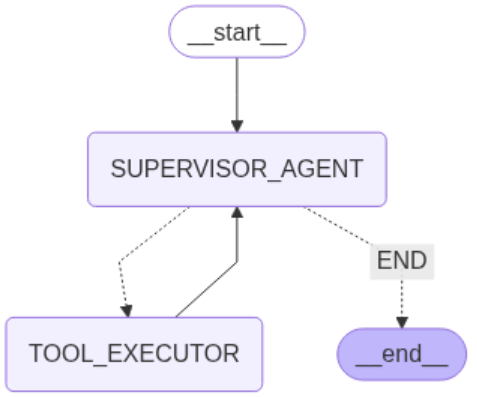

# Personal Assistant Bot

A robust, AI Agentic assistant that turns fuzzy user requests into actionable, structured JSON. Supports:

* Intent categorization (dining, travel, gifting, cab booking, or other)
* Key entity extraction (date, time, location, etc.)
* Follow-up question generation
* Web search results for non-standard queries

Backend powered by [LangGraph](https://github.com/langchain-ai/langgraph) agentic framework, with a simple, chat-style Streamlit frontend.

---

## Features

* **Natural Language Input:** Users can make requests in everyday language.
* **Accurate Intent Detection:** Bot intelligently classifies and handles queries.
* **Entity Extraction:** Extracts all key details needed for fulfillment.
* **Follow-up Questions:** Prompts user for missing or ambiguous info.
* **Web Search:** For non-standard requests, top web search results are provided.
* **Persistent Conversations:** Conversation state is maintained per user/session.

---

##  Setup Instructions

1. **Clone the Repository**

   ```bash
   git clone https://github.com/vanshajsingla/PersonalAssistantBot.git
   ```

2. **Create & Activate Virtual Environment (Recommended)**

   ```bash
   python -m venv venv
   source venv/bin/activate  # On Windows: venv\Scripts\activate
   ```

3. **Install Requirements**

   ```bash
   pip install -r requirements.txt
   ```

4. **Run the FastAPI Backend**

   ```bash
   uvicorn main:app --reload --port 4005
   ```

5. **Launch the Streamlit App**

   ```bash
   streamlit run streamlit_application.py
   ```

---

## Sample Inputs & Outputs

### **Dining Example**


### **Web Search Example**


### ** Langgraph Graph**


## 📝 Notes
* Please add your own Azure keys.
AZURE_API_KEY = "Your api key"
AZURE_ENDPOINT = "Your azure endpoint url"
AZURE_DEPLOYMENT= "Your gpt model name"
AZURE_API_VERSION = "Your gpt model version"
---


